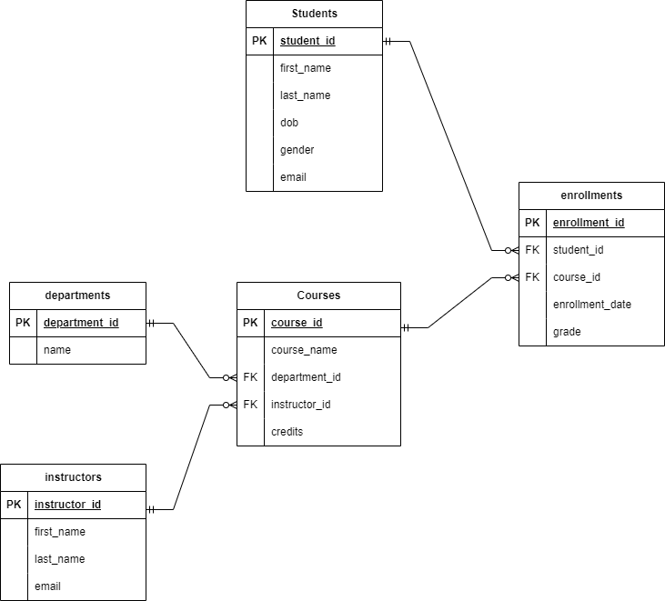

🎓 Student Records Database (MySQL)
📘 Project Title
Student Records Management System

📋 Description
This project is a MySQL-based relational database designed to manage student records. It stores information about students, courses, and the enrollments that link them. The database helps organize data efficiently and allows for easy tracking of which students are taking which courses.

🧱 What the Database Does
- Stores a list of students with their names and email addresses.

- Stores a list of available courses.

- Tracks enrollments, showing which student is enrolled in which course.

- Ensures data integrity using primary and foreign keys.

📁 What's Included
student_records.sql — A single, well-commented SQL file that:

- Creates the database and tables.

- Sets up relationships (primary and foreign keys).

🗂️ Tables and Structure
1. Students
student_id – INT, Primary Key

name – VARCHAR, Not Null

email – VARCHAR, Unique, Not Null

2. Courses
course_id – INT, Primary Key

course_name – VARCHAR, Not Null

3. Enrollments
id – INT, Primary Key

student_id – INT, Foreign Key → Students

course_id – INT, Foreign Key → Courses

🛠️ How to Run
Open your MySQL interface (MySQL Workbench, phpMyAdmin, or terminal).

Import or run the student_records.sql file:

- sql
- Copy
= Edit
SOURCE path_to/student_records.sql;
The script will:

Create the student_records database.

Create all tables with constraints.

Populate the tables with sample data.

🖼️ ERD (Entity-Relationship Diagram)

📌 Notes
Relationships are properly enforced using FOREIGN KEY constraints.

Designed for basic academic or school use cases.

Easy to expand if more features are needed (e.g., grades, instructors, etc.)

